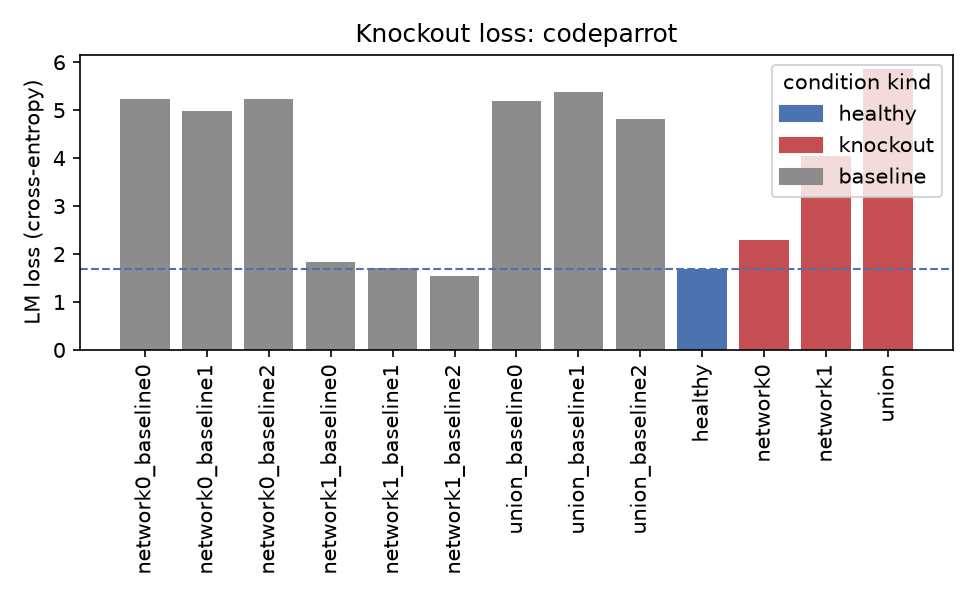
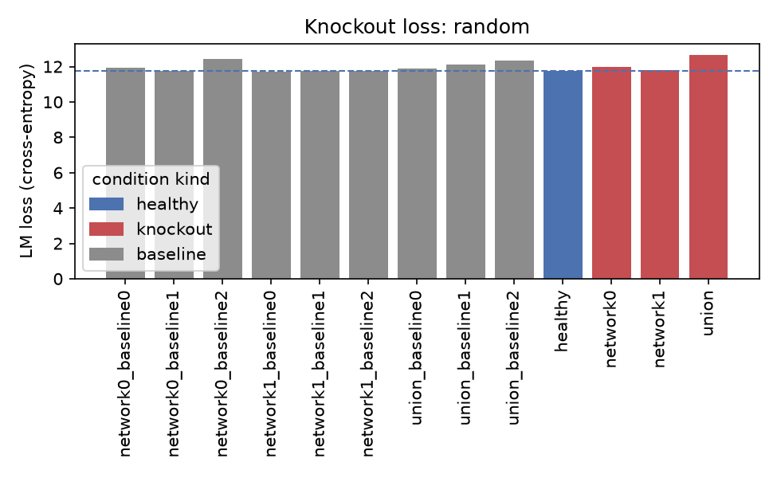
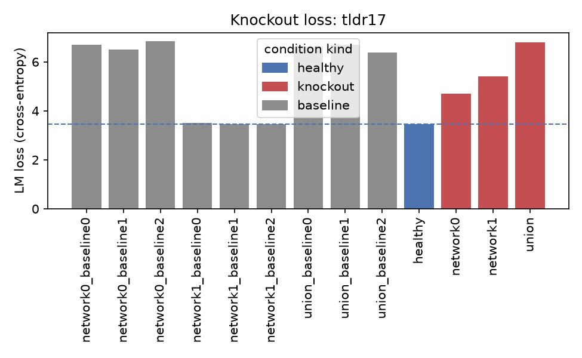
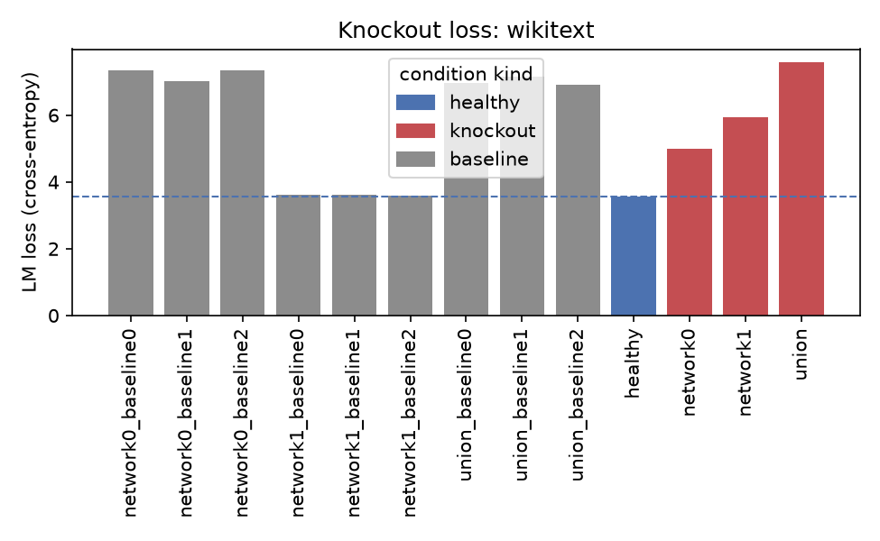
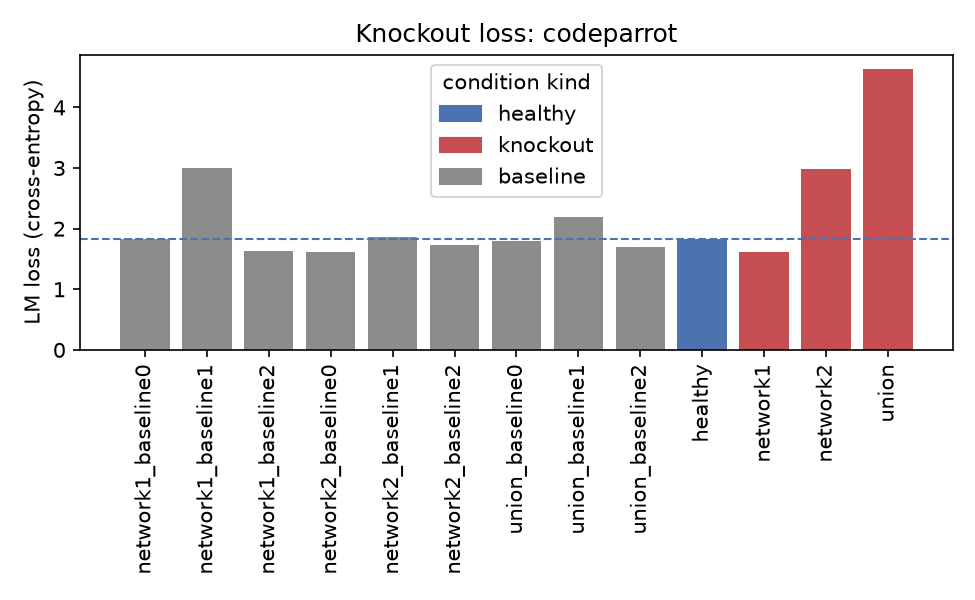
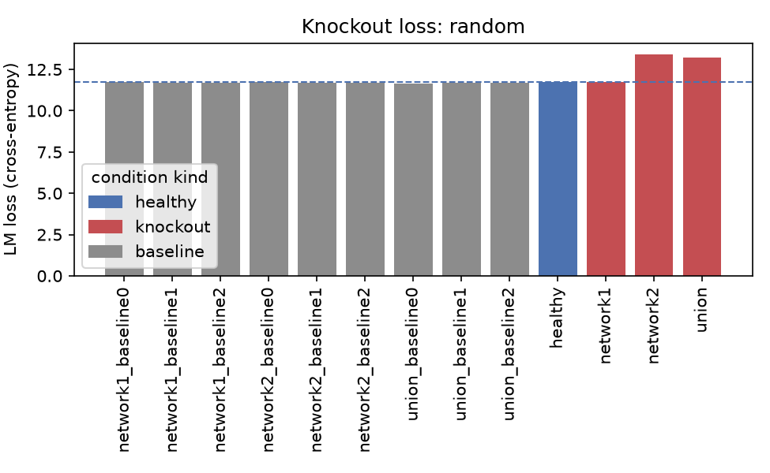
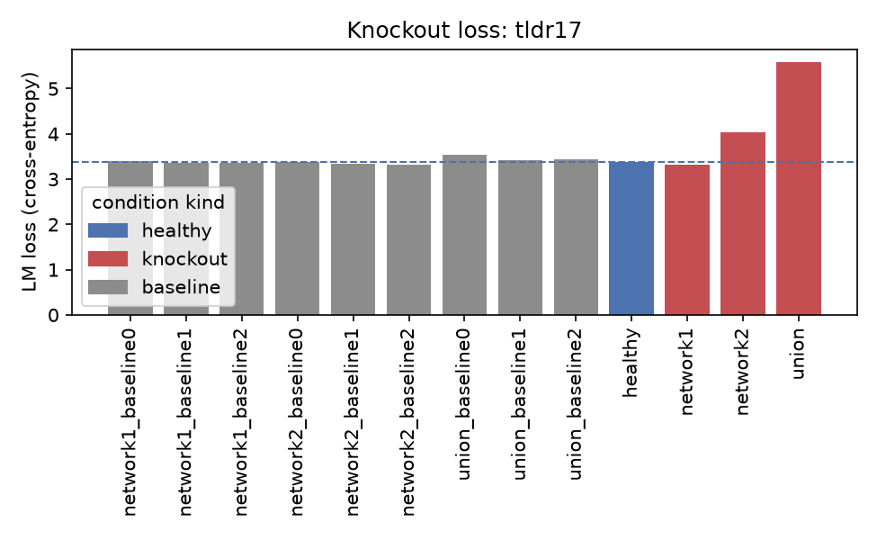
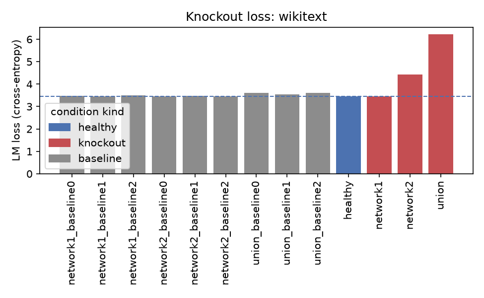

# Sweep: knockout_scale

2 runs

## model_name-gpt2-medium
- params: `model_name=gpt2-medium`
- output_dir: `/Users/sebastianchegini/surf/fork/parcelmate/parcelmate/c_outputs/sweeps/knockout_scale/model_name-gpt2-medium` (441 plots)

**knockout loss summary**

| condition | kind | domain | loss | perplexity | n_tokens |
|---|---|---|---|---|---|
| healthy | healthy | codeparrot | 1.677 | 5.350 | 50078 |
| network0 | knockout | codeparrot | 2.285 | 9.830 | 50078 |
| network0_baseline0 | baseline | codeparrot | 5.239 | 188.445 | 50078 |
| network0_baseline1 | baseline | codeparrot | 4.986 | 146.326 | 50078 |
| network0_baseline2 | baseline | codeparrot | 5.225 | 185.771 | 50078 |
| network1 | knockout | codeparrot | 4.053 | 57.571 | 50078 |
| network1_baseline0 | baseline | codeparrot | 1.842 | 6.309 | 50078 |
| network1_baseline1 | baseline | codeparrot | 1.703 | 5.489 | 50078 |
| network1_baseline2 | baseline | codeparrot | 1.532 | 4.629 | 50078 |
| union | knockout | codeparrot | 5.868 | 353.372 | 50078 |
| union_baseline0 | baseline | codeparrot | 5.185 | 178.486 | 50078 |
| union_baseline1 | baseline | codeparrot | 5.380 | 217.079 | 50078 |
| union_baseline2 | baseline | codeparrot | 4.819 | 123.857 | 50078 |
| healthy | healthy | random | 11.751 | 126846.812 | 50078 |
| network0 | knockout | random | 11.971 | 158175.891 | 50078 |
| network0_baseline0 | baseline | random | 11.934 | 152405.516 | 50078 |
| network0_baseline1 | baseline | random | 11.749 | 126601.750 | 50078 |
| network0_baseline2 | baseline | random | 12.417 | 247052.156 | 50078 |
| network1 | knockout | random | 11.807 | 134229.672 | 50078 |
| network1_baseline0 | baseline | random | 11.688 | 119149.578 | 50078 |
| network1_baseline1 | baseline | random | 11.736 | 124972.133 | 50078 |
| network1_baseline2 | baseline | random | 11.734 | 124727.008 | 50078 |
| union | knockout | random | 12.673 | 319037.188 | 50078 |
| union_baseline0 | baseline | random | 11.886 | 145220.453 | 50078 |
| union_baseline1 | baseline | random | 12.112 | 182035.703 | 50078 |
| union_baseline2 | baseline | random | 12.358 | 232726.094 | 50078 |
| healthy | healthy | tldr17 | 3.446 | 31.385 | 50078 |
| network0 | knockout | tldr17 | 4.706 | 110.571 | 50078 |
| network0_baseline0 | baseline | tldr17 | 6.693 | 807.017 | 50078 |
| network0_baseline1 | baseline | tldr17 | 6.514 | 674.326 | 50078 |
| network0_baseline2 | baseline | tldr17 | 6.856 | 949.832 | 50078 |
| network1 | knockout | tldr17 | 5.408 | 223.204 | 50078 |
| network1_baseline0 | baseline | tldr17 | 3.517 | 33.682 | 50078 |
| network1_baseline1 | baseline | tldr17 | 3.455 | 31.662 | 50078 |
| network1_baseline2 | baseline | tldr17 | 3.464 | 31.934 | 50078 |
| union | knockout | tldr17 | 6.785 | 884.476 | 50078 |
| union_baseline0 | baseline | tldr17 | 6.624 | 753.183 | 50078 |
| union_baseline1 | baseline | tldr17 | 6.702 | 813.979 | 50078 |
| union_baseline2 | baseline | tldr17 | 6.380 | 589.654 | 50078 |
| healthy | healthy | wikitext | 3.555 | 34.990 | 50078 |
| network0 | knockout | wikitext | 4.995 | 147.628 | 50078 |
| network0_baseline0 | baseline | wikitext | 7.344 | 1546.498 | 50078 |
| network0_baseline1 | baseline | wikitext | 7.026 | 1125.122 | 50078 |
| network0_baseline2 | baseline | wikitext | 7.332 | 1527.705 | 50078 |
| network1 | knockout | wikitext | 5.934 | 377.795 | 50078 |
| network1_baseline0 | baseline | wikitext | 3.622 | 37.412 | 50078 |
| network1_baseline1 | baseline | wikitext | 3.603 | 36.710 | 50078 |
| network1_baseline2 | baseline | wikitext | 3.595 | 36.411 | 50078 |
| union | knockout | wikitext | 7.596 | 1991.141 | 50078 |
| union_baseline0 | baseline | wikitext | 6.954 | 1047.136 | 50078 |
| union_baseline1 | baseline | wikitext | 7.142 | 1264.483 | 50078 |
| union_baseline2 | baseline | wikitext | 6.919 | 1011.670 | 50078 |

**connectivity**

**knockout**

**parcellation**

**stability**

## model_name-gpt2-large
- params: `model_name=gpt2-large`
- output_dir: `/Users/sebastianchegini/surf/fork/parcelmate/parcelmate/c_outputs/sweeps/knockout_scale/model_name-gpt2-large` (550 plots)

**knockout loss summary**

| condition | kind | domain | loss | perplexity | n_tokens |
|---|---|---|---|---|---|
| healthy | healthy | codeparrot | 1.826 | 6.209 | 50078 |
| network1 | knockout | codeparrot | 1.610 | 5.004 | 50078 |
| network1_baseline0 | baseline | codeparrot | 1.836 | 6.272 | 50078 |
| network1_baseline1 | baseline | codeparrot | 3.004 | 20.166 | 50078 |
| network1_baseline2 | baseline | codeparrot | 1.625 | 5.079 | 50078 |
| network2 | knockout | codeparrot | 2.984 | 19.773 | 50078 |
| network2_baseline0 | baseline | codeparrot | 1.617 | 5.039 | 50078 |
| network2_baseline1 | baseline | codeparrot | 1.864 | 6.451 | 50078 |
| network2_baseline2 | baseline | codeparrot | 1.738 | 5.687 | 50078 |
| union | knockout | codeparrot | 4.640 | 103.582 | 50078 |
| union_baseline0 | baseline | codeparrot | 1.789 | 5.985 | 50078 |
| union_baseline1 | baseline | codeparrot | 2.199 | 9.014 | 50078 |
| union_baseline2 | baseline | codeparrot | 1.692 | 5.432 | 50078 |
| healthy | healthy | random | 11.725 | 123651.570 | 50078 |
| network1 | knockout | random | 11.727 | 123859.555 | 50078 |
| network1_baseline0 | baseline | random | 11.757 | 127613.656 | 50078 |
| network1_baseline1 | baseline | random | 11.715 | 122393.797 | 50078 |
| network1_baseline2 | baseline | random | 11.715 | 122406.617 | 50078 |
| network2 | knockout | random | 13.431 | 680497.688 | 50078 |
| network2_baseline0 | baseline | random | 11.746 | 126305.875 | 50078 |
| network2_baseline1 | baseline | random | 11.693 | 119765.422 | 50078 |
| network2_baseline2 | baseline | random | 11.700 | 120549.703 | 50078 |
| union | knockout | random | 13.240 | 562460.625 | 50078 |
| union_baseline0 | baseline | random | 11.635 | 112939.406 | 50078 |
| union_baseline1 | baseline | random | 11.678 | 117898.336 | 50078 |
| union_baseline2 | baseline | random | 11.674 | 117500.461 | 50078 |
| healthy | healthy | tldr17 | 3.375 | 29.238 | 50078 |
| network1 | knockout | tldr17 | 3.319 | 27.642 | 50078 |
| network1_baseline0 | baseline | tldr17 | 3.406 | 30.142 | 50078 |
| network1_baseline1 | baseline | tldr17 | 3.363 | 28.878 | 50078 |
| network1_baseline2 | baseline | tldr17 | 3.356 | 28.681 | 50078 |
| network2 | knockout | tldr17 | 4.037 | 56.672 | 50078 |
| network2_baseline0 | baseline | tldr17 | 3.378 | 29.310 | 50078 |
| network2_baseline1 | baseline | tldr17 | 3.346 | 28.397 | 50078 |
| network2_baseline2 | baseline | tldr17 | 3.328 | 27.890 | 50078 |
| union | knockout | tldr17 | 5.594 | 268.849 | 50078 |
| union_baseline0 | baseline | tldr17 | 3.542 | 34.535 | 50078 |
| union_baseline1 | baseline | tldr17 | 3.420 | 30.555 | 50078 |
| union_baseline2 | baseline | tldr17 | 3.435 | 31.032 | 50078 |
| healthy | healthy | wikitext | 3.450 | 31.485 | 50078 |
| network1 | knockout | wikitext | 3.451 | 31.547 | 50078 |
| network1_baseline0 | baseline | wikitext | 3.478 | 32.397 | 50078 |
| network1_baseline1 | baseline | wikitext | 3.454 | 31.613 | 50078 |
| network1_baseline2 | baseline | wikitext | 3.494 | 32.922 | 50078 |
| network2 | knockout | wikitext | 4.429 | 83.815 | 50078 |
| network2_baseline0 | baseline | wikitext | 3.458 | 31.769 | 50078 |
| network2_baseline1 | baseline | wikitext | 3.468 | 32.081 | 50078 |
| network2_baseline2 | baseline | wikitext | 3.457 | 31.706 | 50078 |
| union | knockout | wikitext | 6.232 | 508.941 | 50078 |
| union_baseline0 | baseline | wikitext | 3.601 | 36.631 | 50078 |
| union_baseline1 | baseline | wikitext | 3.540 | 34.454 | 50078 |
| union_baseline2 | baseline | wikitext | 3.604 | 36.748 | 50078 |

**connectivity**

**knockout**

**parcellation**

**stability**

