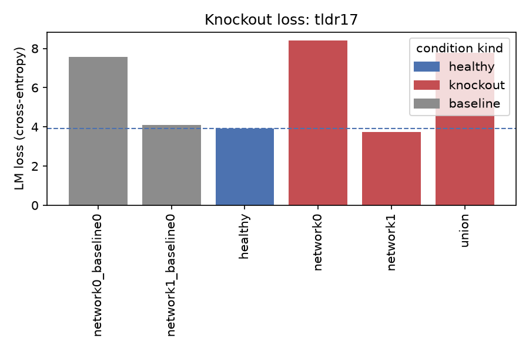
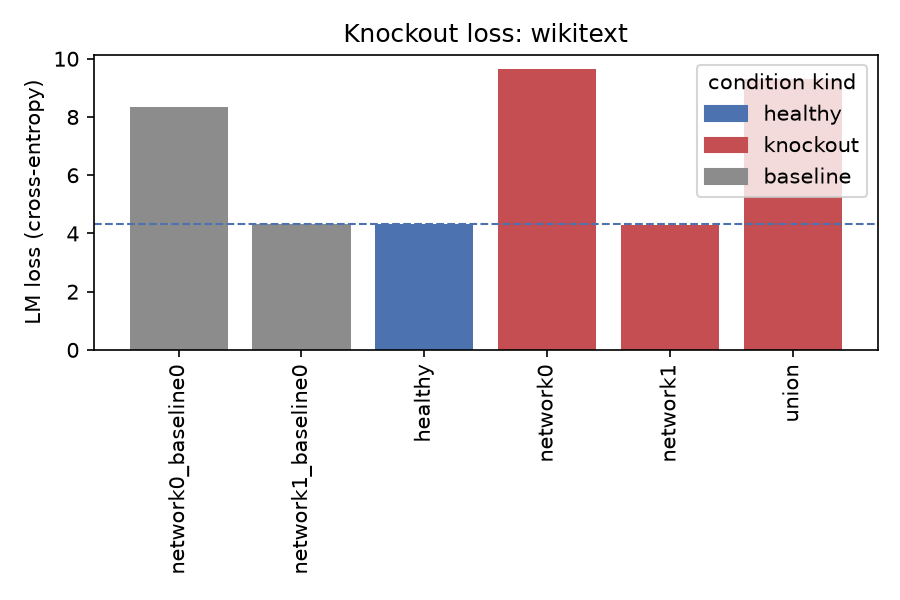
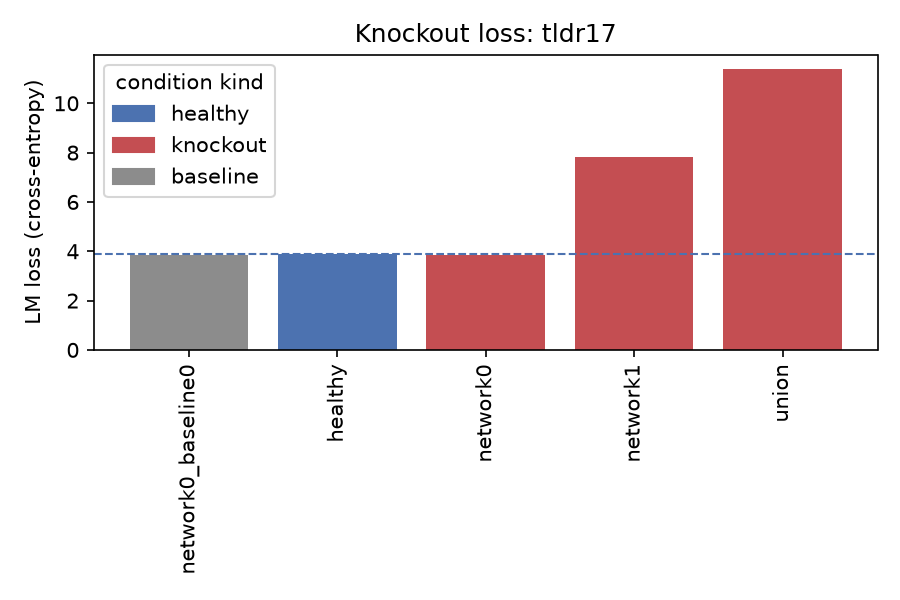
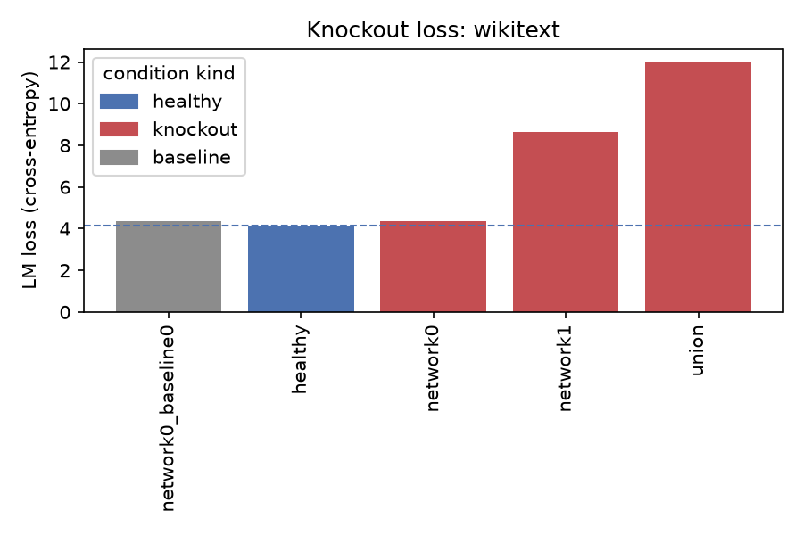

# Sweep: knockout_smoke

2 runs

## knockout_mode-mean
- params: `knockout_mode=mean`
- output_dir: `/Users/sebastianchegini/surf/fork/parcelmate/parcelmate/c_outputs/sweeps/knockout_smoke/knockout_mode-mean` (97 plots)

**knockout loss summary**

| condition | kind | domain | loss | perplexity | n_tokens |
|---|---|---|---|---|---|
| healthy | healthy | tldr17 | 3.918 | 50.299 | 5080 |
| network0 | knockout | tldr17 | 8.419 | 4532.859 | 5080 |
| network0_baseline0 | baseline | tldr17 | 7.555 | 1911.174 | 5080 |
| network1 | knockout | tldr17 | 3.724 | 41.428 | 5080 |
| network1_baseline0 | baseline | tldr17 | 4.087 | 59.572 | 5080 |
| union | knockout | tldr17 | 7.791 | 2419.281 | 5080 |
| healthy | healthy | wikitext | 4.332 | 76.084 | 5080 |
| network0 | knockout | wikitext | 9.663 | 15724.342 | 5080 |
| network0_baseline0 | baseline | wikitext | 8.344 | 4206.524 | 5080 |
| network1 | knockout | wikitext | 4.293 | 73.172 | 5080 |
| network1_baseline0 | baseline | wikitext | 4.325 | 75.532 | 5080 |
| union | knockout | wikitext | 9.297 | 10902.654 | 5080 |

**connectivity**

**knockout**

**parcellation**

**stability**

## knockout_mode-zero
- params: `knockout_mode=zero`
- output_dir: `/Users/sebastianchegini/surf/fork/parcelmate/parcelmate/c_outputs/sweeps/knockout_smoke/knockout_mode-zero` (97 plots)

**knockout loss summary**

| condition | kind | domain | loss | perplexity | n_tokens |
|---|---|---|---|---|---|
| healthy | healthy | tldr17 | 3.896 | 49.218 | 5080 |
| network0 | knockout | tldr17 | 3.866 | 47.745 | 5080 |
| network0_baseline0 | baseline | tldr17 | 3.865 | 47.709 | 5080 |
| network1 | knockout | tldr17 | 7.803 | 2448.026 | 5080 |
| union | knockout | tldr17 | 11.408 | 90015.273 | 5080 |
| healthy | healthy | wikitext | 4.164 | 64.345 | 5080 |
| network0 | knockout | wikitext | 4.361 | 78.357 | 5080 |
| network0_baseline0 | baseline | wikitext | 4.376 | 79.529 | 5080 |
| network1 | knockout | wikitext | 8.652 | 5724.096 | 5080 |
| union | knockout | wikitext | 12.041 | 169504.641 | 5080 |

**connectivity**

**knockout**

**parcellation**

**stability**

